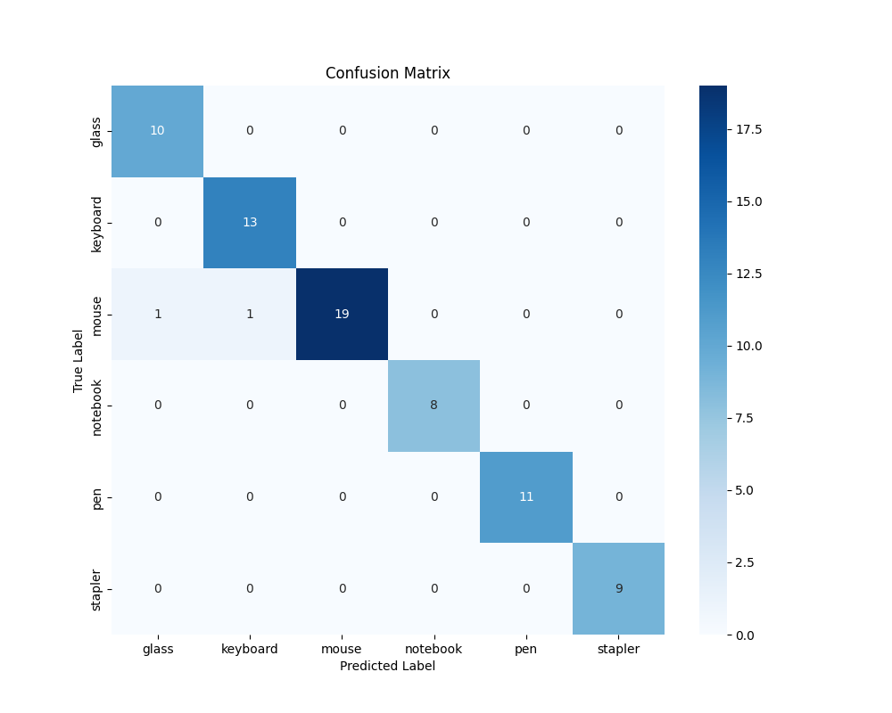

# Office-Classification Coursework

This project is a computer vision program, written in Python, that recognises 6 different classes of office items. It can classify items from a single image or a live camera feed.

The model is built using TensorFlow/Keras with MobileNetV2 for transfer learning.

## 📦 File Structure

Office-Classification/
│
├── dataset/                  
│   ├── test/
│   ├── train/
│   └── valid/
│
├── src/                   
│   ├── train.py
│   ├── evaluate.py
│   └── classifier.py 
│
├── models/             
│   └── office_goods_classifier.keras
│
├── outputs/
│   ├── confusion_matrix.png
│
├── test_images/          
│   └── testclassifier.jpg
│
├── .gitignore           
├── README.md

## 🎯 Classes

The model is trained to recognize the following 6 classes:
* glass
* keyboard
* mouse
* notebook
* pen
* stapler

## ⚙️ Installation

This project requires Python 3.8+ and the following libraries.

1.  Clone or download this repository.
2.  Install the required packages using pip:
    ```bash
    pip install tensorflow scikit-learn matplotlib seaborn opencv-python
    ```

## 🚀 How to Use

There are three main scripts to use:

### 1. Training the Model
To train the model from scratch using the images in the `train/` and `valid/` folders:
```bash
python train.py
```
This script will:

* Load and augment the data.

* Train the model using `transfer learning`.

* Save the final model as `office_goods_classifier.keras`.

* Print a full evaluation report (Accuracy, F1-score, Confusion Matrix) on the `test/` set.


### 2. Evaluating a Trained Model

If you already have a `.keras` model file, you can run a quick evaluation on the `test/` set:
```bash
python evaluate.py
```

This will load `office_goods_classifier.keras` and print the accuracy, F1-score, and classification report.

### 3. Running the classifier

This script is used for live inference. It loads the saved `office_goods_classifier.keras` model.
```bash
python classifier.py
```
When you run it, you will be prompted to choose a mode:

Mode 1 (Live Camera): Opens your webcam for real-time classification.

Mode 2 (Single Image): Asks for the path to an image file.

### 📊 Evaluation Results
The model was evaluated on a held-out test set.

Overall Accuracy: 97.2%

Macro F1-Score: 0.98

### 🧠 Classification Report

| Class         | Precision | Recall | F1-Score | Support |
|----------------|------------|---------|-----------|----------|
| glass          | 0.91       | 1.00    | 0.95      | 10       |
| keyboard       | 0.93       | 1.00    | 0.96      | 13       |
| mouse          | 1.00       | 0.90    | 0.95      | 21       |
| notebook       | 1.00       | 1.00    | 1.00      | 8        |
| pen            | 1.00       | 1.00    | 1.00      | 11       |
| stapler        | 1.00       | 1.00    | 1.00      | 9        |
| **Weighted Avg** | **0.97**  | **0.97** | **0.97**  | **72**   |

### 🌀 Confusion Matrix


Performance: The model performs very well, with most predictions being correct. The correct predictions are shown on the main diagonal (top-left to bottom-right).

glass: 10 correct predictions.

keyboard: 13 correct predictions.

mouse: 19 correct predictions.

notebook: 8 correct predictions.

pen: 11 correct predictions.

stapler: 9 correct predictions.

Errors: There are only two misclassifications, both involving the 'mouse' class:

1 'mouse' was incorrectly predicted as 'glass'.

1 'mouse' was incorrectly predicted as 'keyboard'.

### ❌ Brief Error Analysis

The model's performance is extremely strong. The only errors on the test set occurred with the mouse class, which was misclassified once as glass and once as keyboard. This suggests a slight visual ambiguity, possibly due to object color (e.g., a black mouse near a black keyboard) or surface reflections.

### ⚠️ Troubleshooting
Problem: The classifier gets "stuck" on one class, even when I show it something else.

Solution: This is a preprocessing error. It means the image from the camera is being processed differently than the images used for training. This was fixed in run_classifier.py by removing the extra preprocess_input function, as that layer is already saved inside the model.

Problem: The model confuses two items in the live video (e.g., thinks a shiny stapler is glass).

Solution: This is a data problem (domain gap). The live video looks different from the training photos (e.g., different lighting, reflections). To fix it, more "difficult" pictures were added of the problematic items (like the shiny stapler) to train/ and valid/ folders as well as added another augmenation `layers.RandomBrightness(0.2),` for better result then retrain the model by running train.py again.
